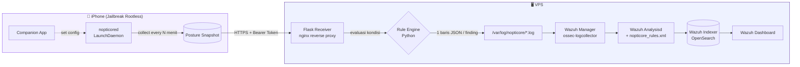

<div align="center">
  

  # Nopticore

  **Posture & security monitoring daemon untuk perangkat iOS jailbreak**

</div>

<br/>

> **Disclaimer**
> Nopticore dibuat untuk keperluan riset/pembelajaran pribadi seputar keamanan iOS dan integrasi SIEM (Wazuh) — bukan proyek atau properti perusahaan mana pun. Semua pengujian dilakukan pada perangkat milik sendiri yang sudah di-jailbreak secara sadar oleh pemiliknya. Proyek ini **tidak dimaksudkan** untuk memata-matai, mengeksploitasi, atau merugikan pihak lain, dan tidak boleh dipasang di perangkat tanpa izin eksplisit dari pemiliknya. Gunakan secara bertanggung jawab dan sesuai hukum yang berlaku di wilayah masing-masing.

---

## Ringkasan

Nopticore terdiri dari tiga bagian:

1. **Daemon iOS** (`nopticored`) — LaunchDaemon ringan yang berjalan di background pada device jailbreak, mengumpulkan *posture* device secara berkala (proses berjalan, paket terinstal, daemon persisten, kondisi jaringan, resource, dll).
2. **Companion App** — aplikasi iOS untuk mengatur backend URL, token, dan tier pengumpulan data, plus melihat status daemon.
3. **Wazuh SIEM** — backend menerima data lewat receiver Flask, mengevaluasi kondisi mencurigakan, lalu memunculkan alert & dashboard monitoring.

Tujuannya sederhana: membantu mendeteksi lebih dini kalau ada proses, tool, atau perubahan konfigurasi mencurigakan (Frida, sideloading, daemon asing, dsb) di perangkat yang sudah jailbreak — sehingga device bisa tetap dipantau dan lebih terjaga dari ancaman.

---

## Arsitektur



---

## Data yang Dikumpulkan Daemon

| Field | Deskripsi |
|---|---|
| `device_model`, `os_version`, `hostname` | Identitas dasar device |
| `is_jailbroken`, `jailbreak_artifacts` | Deteksi tweak/file jailbreak yang ditemukan |
| `installed_packages` | Daftar paket dari dpkg (Cydia/Sileo) |
| `installed_apps` | Aplikasi pihak ketiga terinstal (app Apple bawaan difilter) |
| `running_processes` | Proses berjalan — detail lengkap (path + status code-sign) hanya untuk proses yang mencurigakan |
| `persistent_daemons` | Daftar `.plist` di LaunchDaemons (indikasi persistence) |
| `network_interfaces`, `local_ip`, `ssh_port_open` | Kondisi jaringan device |
| `battery`, `memory`, `cpu`, `disk_usage`, `root_disk_usage`, `swap_usage` | Kondisi resource device |
| `process_count_by_owner` | Agregasi jumlah proses per owner (indikasi anomali proses root) |
| `uptime_seconds`, `locale`, `tier`, `collector_version` | Metadata tambahan |

---

## Alur Data ke Wazuh

1. Daemon mengirim snapshot posture lengkap ke Flask receiver via HTTPS (`Authorization: Bearer <token per-device>`).
2. Receiver menulis record posture penuh **dan** mengevaluasi kondisi mencurigakan di Python — tiap kondisi yang terpenuhi ditulis sebagai satu baris JSON "finding" terpisah. Ini dilakukan supaya semua temuan pada satu siklus bisa jadi alert independen (Wazuh hanya mengevaluasi satu rule pertama yang match per baris log).
3. Wazuh manager membaca log lewat `log_format json` (bawaan, tanpa decoder custom) lalu mencocokkan ke rules kustom.

**Kondisi yang dideteksi (`finding_type`):**

| Finding | Level | Arti |
|---|---|---|
| `frida_installed` | 10 | Frida server terpasang |
| `frida_persistent` | 12 | Frida server aktif otomatis tiap boot |
| `frida_ssh_combo` | 12 | Frida + SSH aktif bersamaan (siap tampering jarak jauh) |
| `sideload_tool` | 8 | Tool sideloading terdeteksi (AltStore, Sideloadly, dsb) |
| `debugger_running` | 10 | Tool debugger/instrumentasi berjalan |
| `suspicious_persistent_daemon` | 10 | Daemon persisten mencurigakan |
| `ssh_open` | 6 | Port SSH terbuka |
| `jailbreak_artifact_high` | 8 | Jumlah artefak jailbreak di atas ambang batas |
| `disk_low` / `battery_low` / `swap_high` | 4–5 | Anomali resource |
| `root_process_high` | 7 | Jumlah proses root tidak wajar |

File konfigurasi Wazuh yang dipakai ada di [`docs/wazuh/`](docs/wazuh/):
- [`nopticore_rules.xml`](docs/wazuh/nopticore_rules.xml) — rules kustom (ID 101000–101042)
- [`ossec-localfile-snippet.xml`](docs/wazuh/ossec-localfile-snippet.xml) — konfigurasi log collector (built-in JSON decoder)
- [`nopticore-logrotate`](docs/wazuh/nopticore-logrotate) — rotasi log harian di VPS

---

## Dashboard Wazuh

Dashboard custom **"Nopticore - iOS Device Monitoring"** menampilkan total alert, distribusi jenis temuan, temuan per device, serta inventaris apps/packages/network interfaces/proses/resource device secara real-time.


---

## Tampilan Aplikasi

| Splash | Status | Pengaturan |
|---|---|---|
|  |  |  |

---

## Demo

[](docs/video/demo.mp4)

*(klik gambar atau buka [`docs/video/demo.mp4`](docs/video/demo.mp4))*

---

## Tools yang Digunakan

| Tool | Fungsi |
|---|---|
| [Theos](https://theos.dev) | Toolchain build daemon & app iOS (jailbreak) tanpa Xcode |
| Objective-C / UIKit | Bahasa & framework companion app dan daemon |
| Flask (Python) | Receiver HTTP + evaluasi rule kondisi mencurigakan |
| [Wazuh](https://wazuh.com) | SIEM — log collector, rule engine, indexer, dashboard |
| OpenSearch Dashboards | Visualisasi & dashboard monitoring custom |
| nginx | Reverse proxy + TLS untuk endpoint ingest |
| systemd | Menjalankan receiver Flask sebagai service |
| logrotate | Rotasi log harian di VPS |
| Dopamine (rootless jailbreak) | Platform jailbreak target device (iPhone 7 Plus, iOS 15.8.7) |

---

## Struktur Proyek

```
nopticore-ios/
├── Sources/        # Daemon (nopticored) — Objective-C
├── App/             # Companion app — Objective-C/UIKit
├── Resources/        # LaunchDaemon plist, app icons
├── docs/
│   ├── assets/        # Logo
│   ├── screenshots/    # Screenshot dashboard & app
│   ├── video/         # Demo screen recording
│   └── wazuh/         # Rules, decoder config, logrotate
├── Makefile
└── control
```
