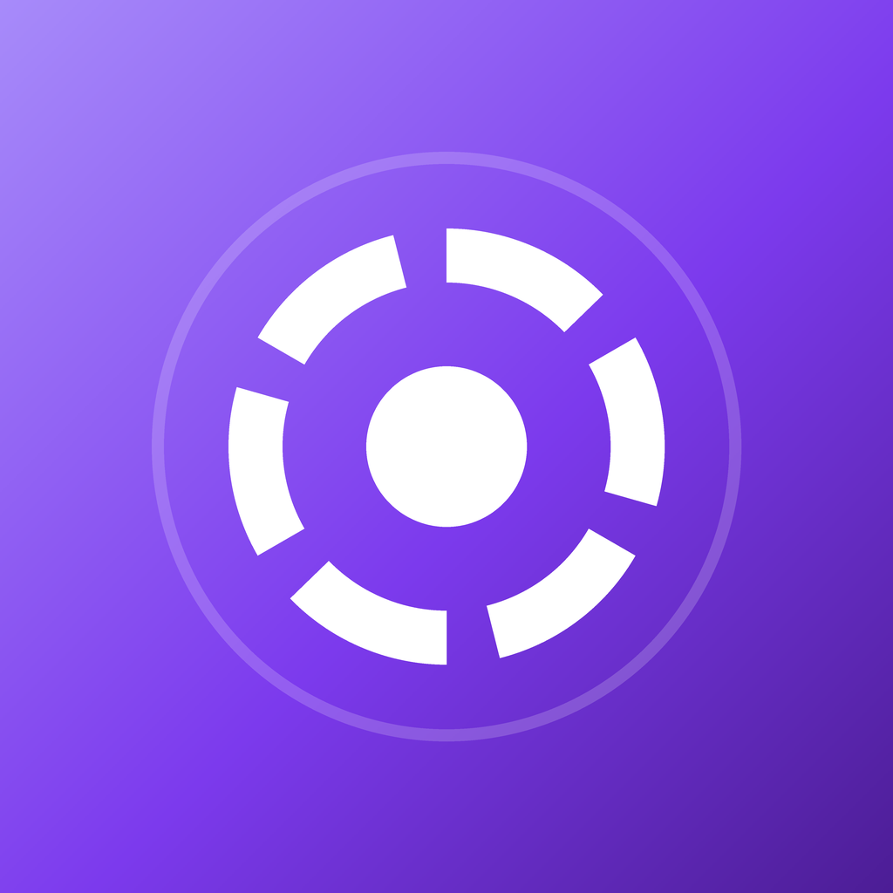
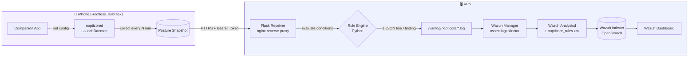
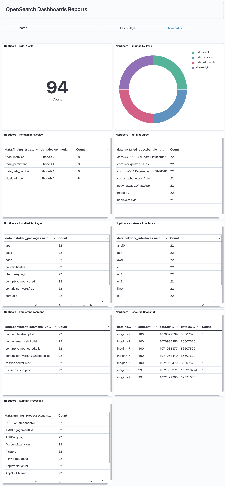

<div align="center">
  

  # Nopticore

  **Posture & security monitoring daemon for jailbroken iOS devices**

</div>

<br/>

> **Disclaimer**
> Nopticore was built for personal research/learning around iOS security and SIEM (Wazuh) integration — it is not affiliated with, or the property of, any employer or company. All testing was done on a personally owned device that was knowingly jailbroken by its owner. This project is **not intended** for spying on, exploiting, or harming anyone, and must not be installed on a device without the explicit consent of its owner. Use responsibly and in accordance with the laws of your jurisdiction.

---

## Overview

Nopticore has three parts:

1. **iOS Daemon** (`nopticored`) — a lightweight LaunchDaemon running in the background on a jailbroken device, periodically collecting device *posture* (running processes, installed packages, persistent daemons, network state, resource usage, etc.).
2. **Companion App** — an iOS app for configuring the backend URL, auth token, and collection tier, plus viewing daemon status.
3. **Wazuh SIEM** — a Flask receiver ingests the data, evaluates suspicious conditions, and surfaces alerts on a monitoring dashboard.

The goal is simple: help detect early signs of suspicious processes, tools, or configuration changes (Frida, sideloading, rogue daemons, etc.) on an already-jailbroken device — so it stays monitored and better protected against threats.

---

## Architecture



---

## Data Collected by the Daemon

| Field | Description |
|---|---|
| `device_model`, `os_version`, `hostname` | Basic device identity |
| `is_jailbroken`, `jailbreak_artifacts` | Detected jailbreak tweaks/files |
| `installed_packages` | Packages from dpkg (Cydia/Sileo) |
| `installed_apps` | Installed third-party apps (Apple's own apps are filtered out) |
| `running_processes` | Running processes — full detail (path + code-sign status) only for suspicious ones |
| `persistent_daemons` | `.plist` files under LaunchDaemons (persistence indicator) |
| `network_interfaces`, `local_ip`, `ssh_port_open` | Device network state |
| `battery`, `memory`, `cpu`, `disk_usage`, `root_disk_usage`, `swap_usage` | Device resource state |
| `process_count_by_owner` | Process count aggregated by owner (root-process anomaly indicator) |
| `uptime_seconds`, `locale`, `tier`, `collector_version` | Additional metadata |

---

## Data Flow into Wazuh

1. The daemon sends a full posture snapshot to the Flask receiver over HTTPS (`Authorization: Bearer <per-device token>`).
2. The receiver writes the full posture record **and** evaluates suspicious conditions in Python — each condition that's true is written as a separate, small JSON "finding" line. This is done so every finding in a single cycle can become an independent alert (Wazuh only evaluates the first matching rule per log line).
3. The Wazuh manager reads the log via `log_format json` (built-in, no custom decoder needed) and matches it against the custom rules.

**Detected conditions (`finding_type`):**

| Finding | Level | Meaning |
|---|---|---|
| `frida_installed` | 10 | Frida server installed |
| `frida_persistent` | 12 | Frida server auto-starts on every boot |
| `frida_ssh_combo` | 12 | Frida + SSH active together (ready for remote tampering) |
| `sideload_tool` | 8 | Sideloading tool detected (AltStore, Sideloadly, etc.) |
| `debugger_running` | 10 | Debugger/instrumentation tool running |
| `suspicious_persistent_daemon` | 10 | Suspicious persistent daemon |
| `ssh_open` | 6 | SSH port open |
| `jailbreak_artifact_high` | 8 | Jailbreak artifact count above threshold |
| `disk_low` / `battery_low` / `swap_high` | 4–5 | Resource anomalies |
| `root_process_high` | 7 | Abnormal root process count |

Wazuh config files used are under [`docs/wazuh/`](docs/wazuh/):
- [`nopticore_rules.xml`](docs/wazuh/nopticore_rules.xml) — custom rules (ID 101000–101042)
- [`ossec-localfile-snippet.xml`](docs/wazuh/ossec-localfile-snippet.xml) — log collector config (built-in JSON decoder)
- [`nopticore-logrotate`](docs/wazuh/nopticore-logrotate) — daily log rotation on the VPS

---

## Wazuh Dashboard

The custom **"Nopticore - iOS Device Monitoring"** dashboard shows total alerts, finding-type distribution, findings per device, and a live inventory of apps/packages/network interfaces/processes/resource usage.



---

## App Screenshots

| Splash | Status | Settings |
|---|---|---|
|  |  |  |

---

## Demo

<video src="https://raw.githubusercontent.com/inog9/nopticore/main/docs/video/demo.mov" controls width="360"></video>

*(if the player above doesn't render, open [`docs/video/demo.mov`](docs/video/demo.mov) directly)*

---

## Tools Used

| Tool | Purpose |
|---|---|
| [Theos](https://theos.dev) | Build toolchain for the iOS daemon & app (jailbreak), no Xcode required |
| Objective-C / UIKit | Language & framework for the companion app and daemon |
| Flask (Python) | HTTP receiver + suspicious-condition rule evaluation |
| [Wazuh](https://wazuh.com) | SIEM — log collector, rule engine, indexer, dashboard |
| OpenSearch Dashboards | Custom monitoring visualizations & dashboard |
| nginx | Reverse proxy + TLS for the ingest endpoint |
| systemd | Runs the Flask receiver as a service |
| logrotate | Daily log rotation on the VPS |
| Dopamine (rootless jailbreak) | Jailbreak platform on the target device (iPhone 7 Plus, iOS 15.8.7) |

---

## Project Structure

```
nopticore-ios/
├── Sources/          # Daemon (nopticored) — Objective-C
├── App/               # Companion app — Objective-C/UIKit
├── Resources/          # LaunchDaemon plist, app icons
├── docs/
│   ├── assets/          # Logo
│   ├── screenshots/      # Dashboard & app screenshots
│   ├── video/           # Demo screen recording
│   └── wazuh/           # Rules, decoder config, logrotate
├── Makefile
└── control
```
